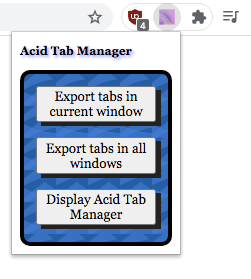
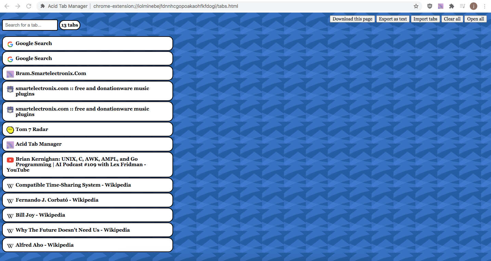
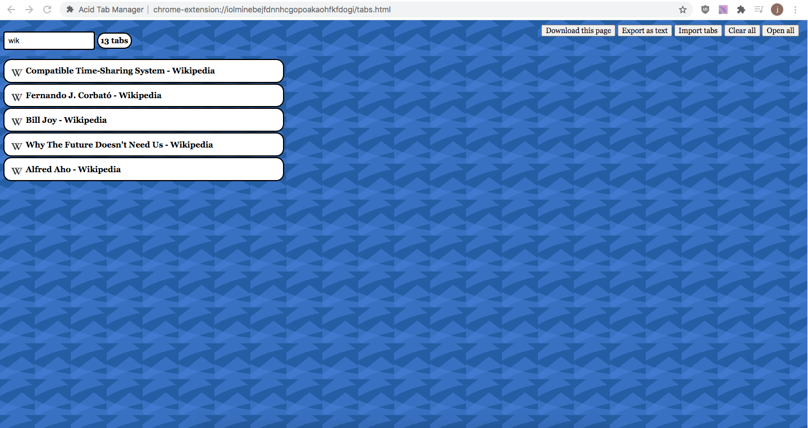
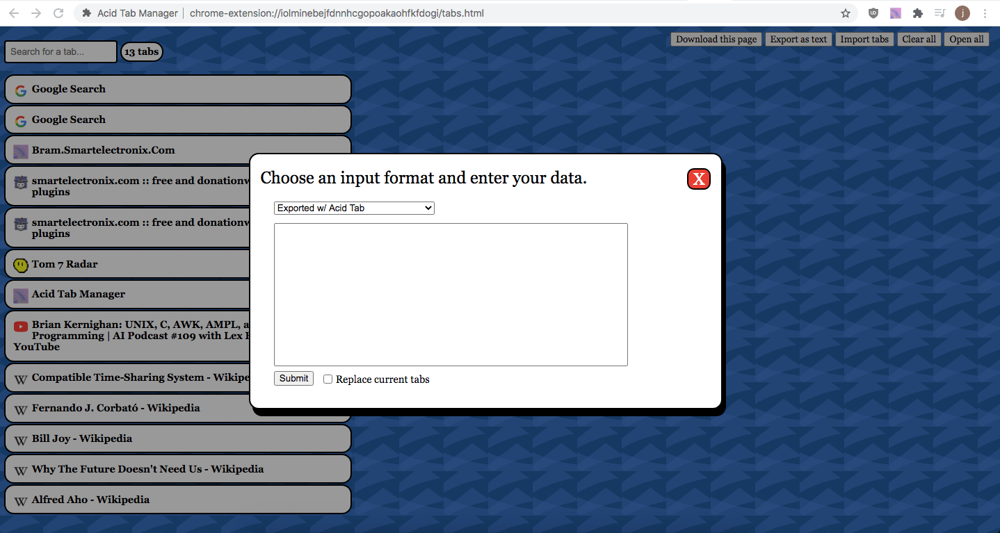
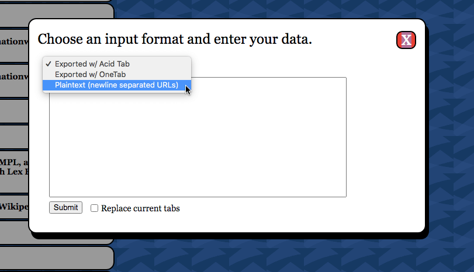
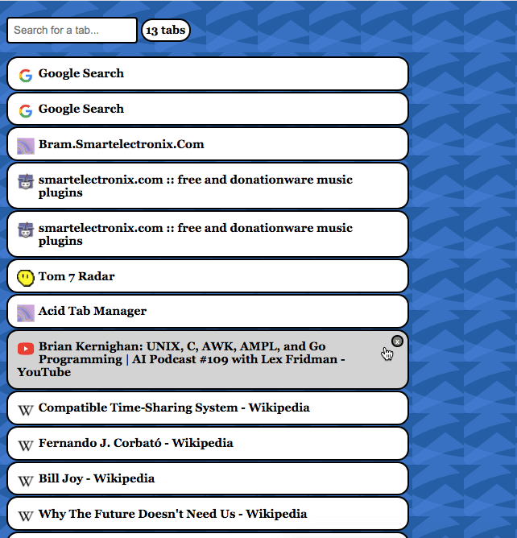
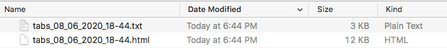

# acidtab

*A chrome extension to store and manage your tabs*

## OwO WHAT'S THIS?
If you are anything like me, you probably have hundreds of tabs open eating up your poor computer's RAM.

Maybe you've tried to fix this by copying URLs into meticulously labled files, or by emailing yourself the links, or even by using an external service like OneTab. I've done all of those things and, quite frankly, the process has gotten so annoying that I refuse to make another `links_june3_2020.txt` ever again. I no longer use OneTab after it lost my tabs for seemingly no reason, so I made myself a tool that I can trust.

## INSTALL
I haven't added Acid Tab to the Chrome web store yet (should I?), so for now you can use this process to load the extension on your own computer:

1. Clone this repository to your computer
2. Navigate to `chrome://extensions/`
3. Enable developer mode
4. Click "Load unpacked"
5. Select this directory in the menu that pops up

And that's it!

## SCREENSHOTS

## CONTRIBUTING

## LICENSE
MIT
